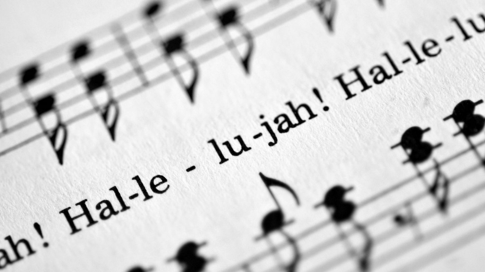

```{r setup, include=FALSE}
knitr::opts_chunk$set(echo = TRUE)
```

 
\newline
\newline
\newline

Music lyrics penetrated into our lives and ubiquitously subtle influence our thoughts. Lyrics can take us back to a certain time when we were happy or sad while opening up our senses to be vulnerable. Lyrics on its own carries a certain amount of emotional weight. So,it's very interesting to look deeper into the patterns and characteristics of different types of song lyrics. What are the changes of lyrics from the past to now? What do the lyrics look like in different music genre? Are there some certain topics or sentiments for the lyrics?

In this project, I carry out an exploratory data analysis (EDA) of the corpus of song lyrics using tools from text mining and natural language processing such as sentiment analysis to explore some charactersitics of lyrics.
\newline
\newline
\newline

```{r, warning=F, message=F, echo=F}
# load all the required packages
library(rvest)
library(tibble)
library(dplyr)
library(tm)
library(tidytext)
library(textdata)
library(tokenizers)
library(tidyverse)
library(beeswarm)
library(syuzhet)
library(d3heatmap)
library(ggplot2)
library(wordcloud2)
library(htmlwidgets)
library(topicmodels)
library(RColorBrewer)
library(stringr)
library(gridExtra)
```

```{r,warning=F, message=F, echo=F}
# load data
load('../output/processed_lyrics.RData') 
load('../output/lyrics_1970.RData')
load('../output/lyrics_1980.RData')
load('../output/lyrics_1990.RData')
load('../output/lyrics_2000.RData')
load('../output/lyrics_2010.RData')

# split years into different decades
dt_lyrics <- dt_lyrics %>%
            mutate(decade = 
                     ifelse(year %in% 1970:1979, "1970s",
                     ifelse(year %in% 1980:1989, "1980s", 
                     ifelse(year %in% 1990:1999, "1990s", 
                     ifelse(year %in% 2000:2009, "2000s", 
                     ifelse(year %in% 2010:2020, "2010s", 
                            "NA"))))))
```

## Lyrics,Past and Now
In order to get some basic characteristics of song lyrics, I first analyze the length of song lyrics in each decades and then discover some timeless words.

### Length of Lyrics
```{r,warning=F, message=F, echo=F,fig.show='hold',fig.width=4,fig.height=5}
# count lyrics' length in 1970s
word.count <- count_words(song.genre.1970$lyrics)
song.genre<- cbind(song.genre.1970, word.count)
lyrics.length<- song.genre %>%
                    filter( decade != "NA")%>%
                    group_by(decade)

# boxplot of lyrics' length in 1970s
lyrics.length %>%
          ggplot(aes(genre,word.count,fill = genre))+
          geom_boxplot()+
          facet_wrap(~decade,ncol = 8)+
          labs(x = "Genre",y = "Lyric Length")+
          scale_y_continuous(limits=c(0, 1500),breaks=seq(0, 1500, 500))+
          coord_flip()+
          theme_light()

# count lyrics' length in 1980s
word.count <- count_words(song.genre.1980$lyrics)
song.genre<- cbind(song.genre.1980, word.count)
lyrics.length<- song.genre %>%
                    filter( decade != "NA")%>%
                      group_by(decade) 

# boxplot of lyrics'length in 1980s
lyrics.length %>%
          ggplot(aes(genre,word.count,fill = genre))+
          geom_boxplot()+
          facet_wrap(~decade,ncol = 8)+
          labs(x = "Genre",y = "Lyric Length")+
          scale_y_continuous(limits=c(0, 1500),breaks=seq(0, 1500, 500))+
          coord_flip()+
          theme_light()

# count lyrics' length in 1990s
word.count <- count_words(song.genre.1990$lyrics)
song.genre<- cbind(song.genre.1990, word.count)
lyrics.length<- song.genre %>%
                    filter( decade != "NA")%>%
                    group_by(decade)

# boxplot of lyrics'length in 1990s
lyrics.length %>%
          ggplot(aes(genre,word.count,fill = genre))+
          geom_boxplot()+
          facet_wrap(~decade,ncol = 8)+
          labs(x = "Genre",y = "Lyric Length")+
          scale_y_continuous(limits=c(0, 1500),breaks=seq(0, 1500, 500))+
          coord_flip()+
          theme_light()

# count lyrics'length in 2000s
word.count <- count_words(song.genre.2000$lyrics)
song.genre<- cbind(song.genre.2000, word.count)
lyrics.length<- song.genre %>%
                    filter( decade != "NA")%>%
                    group_by(decade) 

# boxplot of lyrics'length in 2000s
lyrics.length %>%
          ggplot(aes(genre,word.count,fill = genre))+
          geom_boxplot()+
          facet_wrap(~decade,ncol = 8)+
          labs(x = "Genre",y = "Lyric Length")+
          scale_y_continuous(limits=c(0, 1500),breaks=seq(0, 1500, 500))+
          coord_flip()+
          theme_light()

word.count <- count_words(song.genre.2010$lyrics)
song.genre<- cbind(song.genre.2010, word.count)
lyrics.length<- song.genre %>%
                    filter( decade != "NA")%>%
                    group_by(decade) 

# boxplot of lyrics'length in 2010s
lyrics.length %>%
          ggplot(aes(genre,word.count,fill = genre))+
          geom_boxplot()+
          facet_wrap(~decade,ncol = 8)+
          labs(x = "Genre",y = "Lyric Length")+
          scale_y_continuous(limits=c(0, 1500),breaks=seq(0, 1500, 500))+
          coord_flip()+
          theme_light()

```
\newline
\newline
\newline

According to the box plots of each decade, we can find that lyrics’s length distribution of each music genre is the same no matter in which time periods. For most music genres, the length of Lyrics are less than 1000 words and the average length is around 250 words. However, Hip-Hop songs are obviously longer than other music genre on average, which shows that lyrics are very important to Hip-Hop songs. On the other hand, Jazz music has short lyrics. This difference give us a basic idea about how lyrics are different in different music genre. In fact, Hip-Hop music commonly accompanies rapping. But Jazz music is more enjoyable with the melody.

### Timeless words
As time goes by, I want to know if there are some timeless words among lyrics over all the decades.

```{r, warning=F, message=F, echo=F,fig.align='center',fig.width=9,fig.height=6}
# create words tibble with decade,song,genre
words <- dt_lyrics %>%    
             select(decade,song,genre, stemmedwords) %>% 
             unnest_tokens(word, stemmedwords)

#find timeless words by count words used times. 
timeless.words<- words %>%
                    filter( decade != "NA")%>%
                    group_by(decade) %>%
                    count(word,decade,sort = T) %>%
                    slice(seq_len(8))%>%
                    ungroup()%>%
                    arrange(decade,n)%>%
                    mutate(row = row_number())

timeless.words.plot <- timeless.words %>%
          ggplot(aes(row,n,fill = decade))+
          geom_col()+
          facet_wrap(~decade,scales = "free",ncol = 8)+
          labs(x = NULL,y = "Song Count",title = "Timeless Words")+
          scale_x_continuous(breaks = timeless.words$row,labels = timeless.words$word)+
          coord_flip()+
          theme_light()+
          theme(plot.title = element_text(hjust = 0.5), plot.subtitle = element_text(hjust = 0.5))+
          theme(axis.text.x = element_blank()) +
          theme(axis.ticks.x = element_blank()) 
timeless.words.plot 
```
From the above table, we can see that “LOVE”,”TIME”, “BABY”, “You’re”, “ILL” are some timeless words. Clearly, “LOVE” is everlasting and most common topic of lyrics in all decades. But it’s interesting to find that “ILL” is also very popular from all the time. Therefore, next I want to know how the artists express their thoughts and emotions through lyrics to their listeners.

## Sentiment Analysis
In this part, I will use NRC sentiment lexicon, which categorizes words into emtional categories of "positive", "negative", "anger", "anticipation", "disgust", "fear", "joy", "sadness", "surprise", and "trust", to analyze the emtion of each song in different genres. Then I will use the AFINN sentiment lexicon, which provides numeric positivity values for each word, to examine how often positive and negative words occured in lyrics among all music genres. Which music genre was the most positive or negative overall? 

### Sentiment Analysis using NRC
```{r,warning=F, message=F, echo=F,fig.align='center',fig.width=9,fig.height=6}
# sentiment analysis with nrc
lyrics.sentiment.nrc <-words%>%
                       select(genre,word)%>%
                       group_by(genre)%>%
                       inner_join(get_sentiments("nrc"),by = "word") %>%
                       count(sentiment) %>%
                       spread(sentiment,n,fill = 0)%>%
                       filter(genre!='Not Available' & genre!='Other') %>%
                       ungroup()

genre.sentiment <- lyrics.sentiment.nrc$genre
sentiment.nrc.matrix <- as.matrix(lyrics.sentiment.nrc %>% select(-genre))
sentiment.nrc.score <- diag((1/rowSums(sentiment.nrc.matrix)))%*% sentiment.nrc.matrix
rownames(sentiment.nrc.score) <- genre.sentiment
d3heatmap(sentiment.nrc.score, colors='Reds', scale='none', Rowv=T, Colv=F,xaxis_font_size="14px")

```
Basically, music like Jazz,R&B, Pop, Electronic,Country and Folk express more positive, while Metal and Hip-Pop music tend to show negative emotions. In addition, Indie and Rock music are neutral sentiments in general. According to the map, we can say very few music genres talk about surprise and disgust in lyrics. What’s more, joy plays an important role among all the emotions in most music genres except Metal and Hip-Hop. 

### Sentiment Analysis using AFINN
from the analysis by using nrc, we see that both positive and negative taking leading position in the all emontional categories. In this part, I assigns words with a score that runs between -5 and 5 by using afinn to know which sentiment is more often expressed in lyrics of different music genres. 

```{r,warning=F, message=F, echo=F,fig.align='center',fig.width=9,fig.height=6}
# sentiment analysis with afinn
words_by_genre <- words %>%
                    filter(genre!='Not Available' & genre!='Other') %>%
                    select(genre,word)%>%
                    group_by(genre)%>%
                    count(word,genre,sort = TRUE)%>%
                    ungroup

lyrics.sentiment.afinn <-words_by_genre %>%
                       inner_join(get_sentiments("afinn"),by = "word") %>%
                       group_by(genre)%>%
                       summarize(value = sum(value*n)/sum(n))


lyrics.sentiment.afinn %>%
  mutate(genre = reorder(genre, value)) %>%
  ggplot(aes(genre, value, fill = value > 0)) +
  geom_col(show.legend = FALSE) +
  coord_flip() +
  ylab("Average sentiment value")+
  theme_light()+
  theme(plot.title = element_text(hjust = 0.5), plot.subtitle = element_text(hjust = 0.5))
```
According to the average sentiment value, Hip-Hop and Metal music show strong negative value and Jazz music is the most postive. In addition, music like electronic and folk are neutral sentiments. Comapring the sentiment analysis by nrc and the anlaysis by afinn, we find that the result are slightly different. Based on the analysis of nrc, rock music is positive.However,rock music is driven by negative sentiment by using afinn to anlaysis the sentiment. Thus, I want to go deeper to see the lyrics in rock music.

## What does Rock music foucus on?
Based on sentiment anlaysis, we know that different genres tend to express different sentiment.However, the sentiment analysis of rock music is slightly different by using different sentiment lexicon. Thus, it’s worth looking deeper to understand if rock music ended up more positive or negative. Therefore, I count the most frequently used words in rock music lyrics to see rock music words countributions.

##### Wordclouds of Rock music
```{r,warning=F, message=F, echo=F,fig.align='center'}
# wordcloud for Rock music
word.rock <- words %>%
                  filter(genre=="Metal")%>%
                  select(word)%>%
                  count(word,sort = T)%>%
                  top_n(300)
wordcloud2(word.rock,size = 0.6,shape = "circle’")

```
In rock music, "time" is the most important word. Postive words such as “love”,"heart","dream","soul"and "live" are frequently used.On the other hand, however, negative words like "die","death", "dead","ill","pain","blood" and "dark" are mentioned a lot.According to the wordcloud, we can find that the sentiment of rock music is mixed, which explain why using different sentiment lexicon to categorizes words lead to some slightly different analysis results. 


## Summary
By analyzing song lyrics in different decade and different musc genres, I get the following results.

+ In general, the change of tiem does not affect the length of lyrics. For most music genres, the length of Lyrics are less than 1000 words and the average length is around 250 words.

+ “LOVE”,”TIME”, “BABY”, “You’re”, “ILL” are some popular words that artiest prefer to use no matter in which decades.

+ Different music genre express different sentiment. Basically, Jazz,R&B,Pop and Country tend to express positive while Metal and Hip-Pop music tend to show negative emotions. Others are close to neutral sentiments.

+ From wordclouds we can see that lyrics don't consist of one kind of monotonous emotional words.The words of lyrics are colorful.

### References

- https://www.tidytextmining.com/tidytext.html
- https://www.datacamp.com/community/tutorials/sentiment-analysis-R
